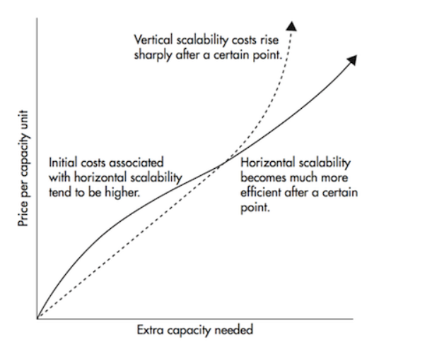

# Fundamentals of Distributed Systems
Nowadays, almost every large-scale application is based in distributed computing. So understanding distributed system concepts 
is crucial in designing fault-tolerant, highly scalable, and low-latency srvices. 

## What is Distributed System ? How does it Work?
A distributed system is a collection of independent software components or machines that work together as a single
system for the end user. These components are spread across multiple computer connected by a local or a wide area 
network and exchange messages to complete tasks efficiently. Most of the time, these components operate concurrently
and fail independently without affecting the system's performance.

Distributed systems can process large numbers of requests and manage millions of users at the same time. Because several
machines can perform the same task concurrently, if one machine is unavialble, the others keep the system running, ensuring
fault tolerance and reliability. They are easily scalable and significantly increase performance as well.

For example, suppose we are using traditional databases stored on a single machine to perform read and write operations. 
If the volume of data increases, the query performance will decrease. One solution is to partition the database system on multiple machines.
If read traffic is much more than write traffic, we can use master-slave replication to handle read and write requests separately.

So it is evident that such systems consist of considerable complexity.

The critical question is: Why are we using distributed systems if they are challenging to manage? Think!

## Scalability in a distributed System

One of the major advantages of adopting distributed systems is their ability to provide highly scalable services. Such systems can continuously evolve 
to support growing workloads like handling a large number of user requests or a large number of database transactions. So the goal of a scalable distributed
system is to achieve high scalability without performance loss.

Generally, the performance of a system declines with the increase in system size. For example, network speed may become slower because nodes tend to be 
far apart, performance may decrease due to increased user traffic, etc. So scalable distributed systems avoid such a situation and evenly balance the 
incoming load among all available nodes.

Traditional systems generally scale using `Vertical Scaling`, i.e., by adding more power(CPU, RAM, Storage, etc.) to an existing server. Such vertical 
scalable services are incompatible when operating on a vast scale because they are expensive and more prone to a single point of failure. This is 
usually limited to the capacity of a single server and scaling beyond that capacity often involves downtime.

However, `horizontal scaling` allows us to scale indefinitely by adding more servers to the pool of resources. If there is any performance degration, 
we only need to add more machines, making the service extremely fast without much overhead cost compared to vertical scaling.

The figure below describes how much a company costs to use Vertical vs Horizontal Scaling.

Good examples of horizontal scaling are Cassandra and MongoDB, as they both provide an eay way to scale horizontally by adding more machines to meet growing needs. Similarly, MySQL is an excellent example of vertical scaling as it allows for an easy way to scale vertical by switching from smaller to bigger machines. However, this process often involves downtime.

## Performance of a Distributed System
There are two standard parameters to measure the performance of a distributed system:
#### 1. Latency or response time, which denotes the delay to obtain the response of a first request.
#### 2. Throughput, which denotes the number of requests served in a given time.
These two things are related to the volume of reponses sent by nodes and the size of responses representing the volume of data exchanges.

`NOTE:` The performance of distributed systems also includes factors like network load, the architecture of software and hardware components etc.

Most highly scalable services are read-heavy, which might decrease system performance. To deal with this, one can use replication, which also ensures high availability and fault-tolerant behaviour. But there is a specific limit to this! To further increase performance, distributed systems offer another way to scale the service by sharding databases. With sharding, one can easily split the central database server into smaller servers called shards and achieve higher performance by distributing the load.

## Scalability vs Performance
Scalability is related to performance, but they are not the same thing. Performance measures how long it takes to process a request or to perform a specific task, whereas scalability measures how much we can grow or shrink.

For example, if we had 100 concurrent users, with each user sending a request once every 5 seconds (on average). In this situation, we would end up with a throughput requirement of 20 requests per second. The performance will decide how much timewe need to serve these 20 requests per second, and scalability will determine how many more users we can handle and how many more requests the system will serve without degrading the user experience.

## Reliability of a Distributed System
Reliability represents one of the main characteristics of any distributed system, defined as the probability of a system failure in a given period. A distributed system is considered reliable if it keeps delivering its services even when one or several components fail. In such systems, another healthy machine can always replace any failing machine.

For example, one of the primary requirements of an e-commerce store is that any user transaction should never be cancelled due to a failure of a machine. If a user has added an item to the shopping cart, the system is expected not to lose it. So reliability can be achieved through redundancy, i.e. if the server carrying the user’s shopping cart fails, another server with the exact replica of the shopping cart should replace it.Redundancy has a cost, and a reliable system has to pay to achieve such resilience by eliminating every single point of failure.

## How important is Reliability?
Bugs or outages of critical applications cause lost productivity and can have considerable costs in terms of lost revenue and damage to reputation. Even in noncritical applications, businesses have a responsibility towards their users. Suppose a customer stored all their necessary details in an application. How would they feel if that database was suddenly corrupted? How would they feel if their no mechanism to restore if from a backup?

## Availability of a Distributed System
Availability is a simple measure of the percentage of time that a system or service remains operational under normal conditions. An aircraft that can be flown many hours a month without much downtime can be said to have high availability.

For example, Amazon describes availability for internal services in terms of the 99.9th percentile. Even though it only affects 1 in 1,000 requests, this is important because the customers with the slowest requests often have the most data on their accounts because they have made many purchases (most valuable customers).

## Reliability vs Availability
If a system is reliable, it is available. However, if it is available, it is not necessarily reliable. In other words, high reliability contributes to high availability. Still, achieving high availability even with an unreliable system is possible by minimising maintenance time and ensuring that machines are always available when needed.

For example, suppose a system has 99.99% availability for the first two years after its launch. Unfortunately, the system was launched without any security testing. The customers are happy, but they never realize that system is vulnerable to security risks. In the third year, the system experiences a series of security problems that suddenly result in low availability for long periods. This may result in financial loss to the customers.

## Other Key features of Distributed System
### Manageability
Another important consideration while designing a distributed system is manageability, i.e. how simple to operate and maintain a system. If the delay in fixing a system increases, availability will decrease. In other words, eaily detection of faults can reduce or avoid system downtime.
### Concurrency
Components in distributed systems are executed in concurrent processes. In other words, distributed systems enable several components to access and update shared resources concurrency without interference. Concurrency helps us reduce latency and increases throughput of the distributed system.
### Transparency
Transparency is an essential feature that allows users to see distributed systems as a single logical device without being concerened about the system architecture. This is an abstraction where a distributed system consisting of millions of components spread across multiple computers works as a single system for the end user.
### Openness
Distributed systems have the flexibility to update and scale them independently. So openness is related to extensions and improvements of distributed systems. This is about: How one can easily integrate new components or replace existing ones without affecting the overall computing environment.
### Security
In a distributed system, users send requests to access some of the critical data managed by servers — for example, doctors requesting records from hospitals, users purchasing items through an e-commerce website, etc. So distributed systems must avoid denial of service attacks and ensure security and privacy by identifying auser with a secure authentication process.
### Heterogeneity
In distributed systems, components can have variety and differences in networks, hardware, operating systems, programming languages and implementations by different developers.

## What are the Types of Distributed Systems?
The distributed systems fall into any one of the four architectural modes:
### Client-Server Model:
Most of the traditional architecture falls under this category.There is a server to which all the requests are made from the clients. Resource sharingis one of the best examples of the client-server model.
### Three-Tier:
In such architecture, a central server manages all the requests and services and acts as a middle layer between the communication. The middle tier accepts the request, does some pre-processing, and forwards it to the server for further processing.
### Multi-Tier:
Such architectures are used when an application needs to forward requests to various network services. Here the application servers interact both with the presentation tiers and data tiers.
### Peer-to-Peer:
There are no centralised machines required in this architecture. Eachentity behaves as an independent server and performs its roles. Responsibilities
among various servers called peers, and they cooperate to achieve a common goal.
## Conclusion
Distributed systems are the necessity of the modern world as new machines need tobe added, and applications need to scale to deal with technological advancements and better services. It enables modern systems to offer highly scalable, reliable, and fast services.

Such systems can support many requests and compute jobs compared to a single standard system by spreading workloads and requests. Although there are some trade-offs and challenges, distributed systems can transform the world with their services and applications. As a result, almost every application has distributed systemas one of the major components.

